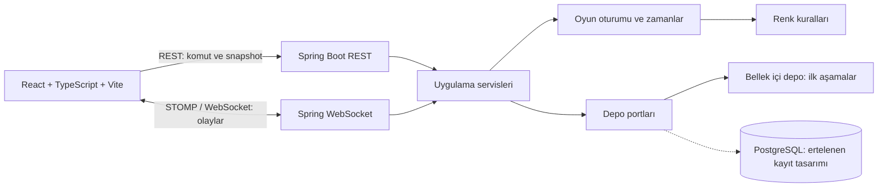

# Mimari — Renk Hafıza Oyunu

## Ürün ve oyun kuralları

İlk sürüm, Dialed.gg akışından esinlenen bir renk hafıza oyunudur. Project ana ekranı oyunları listeler; şimdilik Color oynanabilir, Game1 ve Game2 yer tutucudur. Hedef renk kısa süre gösterilir, ardından gizlenir ve oyuncu onu hafızasından yeniden üretir. Login/register yoktur. Color seçildikten sonra tek kişilik oyun başlatılır; çok oyunculu oyunda 2–8 oyuncu bir lobi koduyla buluşur. Bir maç 5 raunddur.

Raundun sunucu tarafından yönetilen aşamaları:

| Aşama | Başlangıç süresi | Oyuncunun gördüğü |
| --- | ---: | --- |
| `PREVIEW` | 3 saniye | Hedef renk |
| `TRANSITION` | 750 ms | Hedef gizlenir; tahmin ekranı kısa animasyonla açılır, renk seçilebilir |
| `INPUT` | 10 saniye | Renk seçici; hedef görünmez |
| `REVEAL` | Tek kişilikte `Devam` komutuna kadar | Hedef, tahmin ve puan |

Ondalıklı olarak 10.00 üzerinden puan verilir.

Oyuncu `INPUT` sırasında bir `#RRGGBB` tahmini gönderir. Renk seçimi `TRANSITION` ve `INPUT` sırasında sunucuya artan sürüm numaralı taslak olarak kaydedilir. Süre sonunda açık tahmin yoksa en son kaydedilen taslak puanlanır; hiç taslak yoksa 0 puan verilir. Geçerli açık tahmin tek kişilik oyunda sonucu hemen açar. Sonuç, oyuncu `Devam` komutunu verene kadar görünür. Beşinci raundun `Devam` komutu finali açar. Önizleme, geçiş ve tahmin süreleri ile raund sayısı sürümlü `GameConfig` içinde tanımlanır; çok oyunculu sonuç aşamasında ilk hazır oyuncunun ardından 15 saniyelik üst sınır uygulanır.

## Puanlama

Puanı sunucu hesaplar. Renkler sRGB'den Lab uzayına çevrilir ve CIEDE2000 (`ΔE00`) ile karşılaştırılır:

```text
score = clamp(10 × exp(-((ΔE00 / scale)²)), 0, 10)
```

`scale`, kullanıcı testiyle kalibre edilecek bir `GameConfig` değeridir. Tam eşleşme `10.00`, beş raundun toplamı en çok `50.00` puandır. Hesap yüksek hassasiyette yapılır; iki ondalığa yuvarlama yalnız gösterim içindir. Eşit toplam puanda önce düşük toplam `ΔE00`, sonra kısa toplam cevap süresi kullanılır. Config veya algoritma değişirse yeni sürüm yalnız yeni maçlara uygulanır; eski sonuçlar sessizce yeniden hesaplanmaz.

İlk `GameConfig` sürümü `color-v1` ve başlangıç `scale` değeri `20.0` olarak kodlandı; bu puan eğrisi kullanıcı testiyle kalibre edilecektir. Renk dönüşümü sRGB → XYZ (D65) → Bradford uyarlaması → Lab (D50) sırasını izler. [W3C CSS Color 4 dönüşüm adımları](https://www.w3.org/TR/css-color-4/#color-conversion-code) ve [CIEDE2000 yazarlarının referans verileri](https://hajim.rochester.edu/ece/sites/gsharma/ciede2000/) uygulama ve test için kaynak alınmıştır.

## Sistem görünümü



Backend Java 21, Spring Boot ve Gradle kullanır. PostgreSQL şeması ve JPA eşlemeleri daha önce hazırlanmıştır; V1 oyun akışı bu tablolardan veri okumaz veya yazmaz. Mevcut uygulama Flyway migration'ları ve JPA doğrulaması için açılışta PostgreSQL'e ihtiyaç duyar. Canlı ortamda bu bağımlılığın tutulması veya kaldırılması dağıtım sırasında kararlaştırılacaktır. Spring Web/Validation, WebSocket ve anonim oturum için Security gerekli aşamalarda eklenir. İlk sürüm tek uygulama örneği ve Spring'in bellek içi STOMP broker'ıyla çalışır. Redis, Kafka ve ayrı broker V1 kapsamı dışındadır.

Frontend React + TypeScript + Vite ile tek sayfa uygulamasıdır. Özellikler `single-game`, `lobby`, `live-game` ve `color-game` olarak ayrılır. REST komut ve son durum içindir; WebSocket canlı olay içindir. Yeniden bağlanmada veya olay sırası boşluğunda istemci REST snapshot'ı alır. Sayaç, sunucunun `serverTime` ve mutlak `deadline` değerlerinden türetilir.

Tek kişilik maç kimliği yalnız aktif maç için tarayıcı `sessionStorage` alanına yazılır. Sayfa yenilenince istemci aynı maçı `GET /games/{id}` ile okur; alınan aşama ve sunucu zamanı gösterilir. Tamamlanan ya da sunucuda bulunmayan maç kimliği temizlenir. Bu kayıt geçmiş maç listesi değildir ve sunucu yeniden başlatıldıktan sonra maçı kurtarmaz. Klavye kullanımı için yerel renk seçicinin yanında doğrulanan HEX alanı bulunur; aşamalar metinle duyurulur ve odak tahmin, devam ve yeniden oynama kontrollerine taşınır.

## Backend modül sınırları

```text
backend/src/main/java/.../
  common/              ortak süre ve raund ayarları (`GameConfig`)
  guest/               anonim oturum
  game/color/          hedef üretimi, dönüşüm, doğrulama, puanlama
  game/session/        ortak raund ve maç yaşam döngüsü
  lobby/               kod, üyelik, ev sahibi, kapasite
  transport/http/      REST ve DTO
  transport/websocket/ STOMP, abonelik yetkisi, olay yayını
  persistence/entity/  Flyway şemasına eşlenmiş beş JPA Entity
  storage/memory/      ilk depo uygulaması
  storage/postgres/    kalıcı kayıt istenirse ileride eklenecek depo
```

`game/color` HTTP, lobi ve veritabanı bilmez. `game/session` süreleri, durum geçişlerini ve tek kişilik maçları yönetir. Küçük `GameDefinition<Target, Guess>` sözleşmesi hedef oluşturma, tahmin doğrulama ve puanlamayı oyun modülüne bırakır; renk oyunu bu sözleşmenin ilk uygulamasıdır. API'nin ortak maç alanlarından ayrı `gameData` alanı oyuna özel önizleme/sonuç verisini taşır. Yeni oyun eklenirken bir `GameDefinition` ve kendi görünüm verisi eklenir; ortak zaman akışı değiştirilmez. `lobby` katılım ve ev sahibi kurallarını yönetecek ve maç başlatırken `gameType` üzerinden aynı tanımı seçecektir. Controller'lar iş kuralı içermez. `gameType` ile `configVersion` maç modelinde tutulur.

Ortak `GameConfig` yalnız süre ve raund sayısını taşır; renk puan eğrisi `ColorGameConfig` içindedir. PostgreSQL V2 migration'ı `game_session.config_version` alanını ekler. V1'deki `round_submission` renk alanları içerdiği için renk oyununa ait kayıt olarak değerlendirilir; ikinci oyun için ihtiyaç doğduğunda ona özel sonuç tablosu ayrı migration ile eklenir. Böylece mevcut beş tablonun sade yapısı korunur.

## Durum ve veri modeli

| Model | Temel alanlar |
| --- | --- |
| `GuestSession` | kimlik, oluşturma/son görülme zamanı |
| `Lobby` | kod, ev sahibi, üyeler, durum, kapasite, son kullanma zamanı |
| `GameSession` | mod (`SINGLE_PLAYER`/`MULTIPLAYER`), oyun türü, config sürümü, durum, raund sırası |
| `Round` | hedef, `previewUntil`, `inputOpensAt`, `inputClosesAt`, `revealUntil`, durum |
| `Submission` | oyuncu, tahmin, gönderim zamanı, puan, `ΔE00` |

Lobi durumları `WAITING`, `IN_GAME`, `FINISHED`, `EXPIRED` olarak tanımlıdır. Ev sahibi ayrılırsa en eski üye ev sahibi olur; son üye ayrılırsa lobi ve bellekteki maç kaldırılır. Süresi dolan lobiler dakikada bir temizlenir. Rövanş `FINISHED` lobisinde yeni maç açar; eski maç bellekten kaldırılır ve yeni katılan üye eski finali göremez. Tek kişilik raund: `PREVIEW → TRANSITION → INPUT → REVEAL → COMPLETED`; ilk üç aşama sunucu saatine göre ilerler, geçerli tahmin `REVEAL` aşamasını hemen başlatır ve sonraki raund yalnız `Devam` komutuyla başlar. Çok oyunculu maçta tüm oyuncular aynı hedefi ve mutlak aşama zamanlarını paylaşır. Tüm tahminler geldiğinde veya tahmin süresi dolduğunda `REVEAL` açılır; ilk hazır oyuncu 15 saniyelik devam süresini başlatır, herkes hazırsa sonraki raund hemen açılır. Aynı lobiye katılım, başlatma ve tahmin işlemleri atomik yürütülür. Tahmin ilk geçerli kayıtla sabitlenir; aynı payload ile tekrar mevcut durumu döndürür, farklı tekrar `409` verir.

## REST ve canlı olaylar

Tüm REST yolları `/api/v1` altındadır:

| İşlem | Yol |
| --- | --- |
| Tek kişilik başlat | `POST /single-games` |
| Oyun snapshot'ı | `GET /games/{id}` |
| Tek kişilik sonuçtan devam | `POST /games/{id}/continue` |
| Lobi oluştur / katıl | `POST /lobbies`, `POST /lobbies/{code}/join` |
| Lobi snapshot'ı / ayrıl | `GET /lobbies/{code}`, `POST /lobbies/{code}/leave` |
| Çok oyunculu maç | `POST /lobbies/{code}/start`, `POST /lobbies/{code}/rematch`, `GET /lobbies/{code}/game`, `PUT /lobbies/{code}/game/rounds/{roundNumber}/submission`, `POST /lobbies/{code}/game/ready` |
| Tahmin | `PUT /games/{id}/rounds/{roundNo}/submission` |

Snapshot aşamaya ve oyuncuya göre filtrelenir: `INPUT` aşamasında hedef renk ve diğer oyuncuların tahminleri dönmez. `PREVIEW` sırasında hedef tarayıcıya gönderildiğinden DevTools ile görülmesi engellenemez. Sunucu yine de deadline, tek tahmin ve puan kurallarını uygular.

WebSocket yolu `/api/v1/ws`, lobi olay adresi `/topic/lobbies/{code}` olur. Bağlantı mevcut anonim cookie ile açılır; abonelikte lobi üyeliği doğrulanır. Olay zarfında `type`, artan `sequence`, `serverTime`, `gameId` ve `payload` bulunur. 8. aşamada `PLAYER_JOINED` ve `PLAYER_LEFT` yayınlanır; olay üzerine ve yeniden bağlanınca REST snapshot'ı okunur. `ROUND_PREVIEW_STARTED`, `ROUND_INPUT_OPENED`, `PLAYER_SUBMITTED` (yalnız gönderdi bilgisi), `ROUND_RESULT`, `GAME_FINISHED` ve `LOBBY_EXPIRED` ileriki aşamalara aittir. REST hataları kararlı uygulama koduyla Problem Details biçiminde döner.

## Anonim kimlik, güvenlik ve işletim

7. aşamada ilk oyun/lobi isteğinde rastgele anonim oturum oluşturulur; tarayıcıya `HttpOnly`, `SameSite=Lax` cookie verilir, HTTPS isteğinde `Secure` eklenir. Oturum ve lobiler bu aşamada bellektedir. 4. aşamadaki tek kişilik API geçici olarak rastgele UUID oyun kimliğiyle çalışır; kimlik ve erişim kontrolü henüz yoktur. Takma ad kimlik değildir. Lobi REST komutları cookie ile kimliği, durum okuma ise üyeliği doğrular; 8. aşamada WebSocket bağlantısı mevcut anonim cookie'yi ve her abonelik lobi üyeliğini doğrular. Geliştirme ortamında izin verilen WebSocket origin'leri `app.websocket.allowed-origins` ile ayarlanabilir; varsayılanlar `localhost:5173` ve `127.0.0.1:5173` adresleridir. Üretimde frontend ve backend aynı origin altında sunulur; değişiklik yapan cookie tabanlı çağrılarda CSRF koruması 12. aşamada uygulanır. Lobi kodu kriptografik rastgele üretilir; kod denemesi ve istek boyutu sınırlandırması 12. aşamadadır. Cookie, ham hedef veya tahmin loglara yazılmaz.

Kopma sırasında maç saati durmaz; açık tahmin veya kayıtlı taslak bulunmayan raund 0 puandır. Sayfa yenileme aynı anonim cookie ve tarayıcı oturumundaki lobi koduyla güncel snapshot'ı yükler. WebSocket kopması üyeliği silmez. Açıkça ayrılan üye hemen çıkarılır; ev sahibi ayrılırsa en eski üyeye yetki devredilir, son üye ayrılırsa lobi hemen temizlenir. V1'de sunucu yeniden başlarsa aktif ve bitmiş maçlar kaybolur; maç geçmişi sunulmaz. Aktif maçın yeniden başlatma sonrası devamı ve çoklu backend örneği ayrı çalışmadır.

Kritik testler: CIEDE2000 referans çiftleri; hedefin gizlenmesi; deadline ve çift tahmin; son koltuğa eşzamanlı katılım; yetkisiz WebSocket aboneliği; iki tarayıcıda aynı raund; yenileme/kopma; Flyway migration. İlk üretim gözlemi için health, aktif bağlantı/lobi sayısı, hata oranı ve raund geçiş gecikmesi yeterlidir. Arayüzde renk tek başına durum anlatmaz; klavye ve küçük ekran akışı çalışır.
